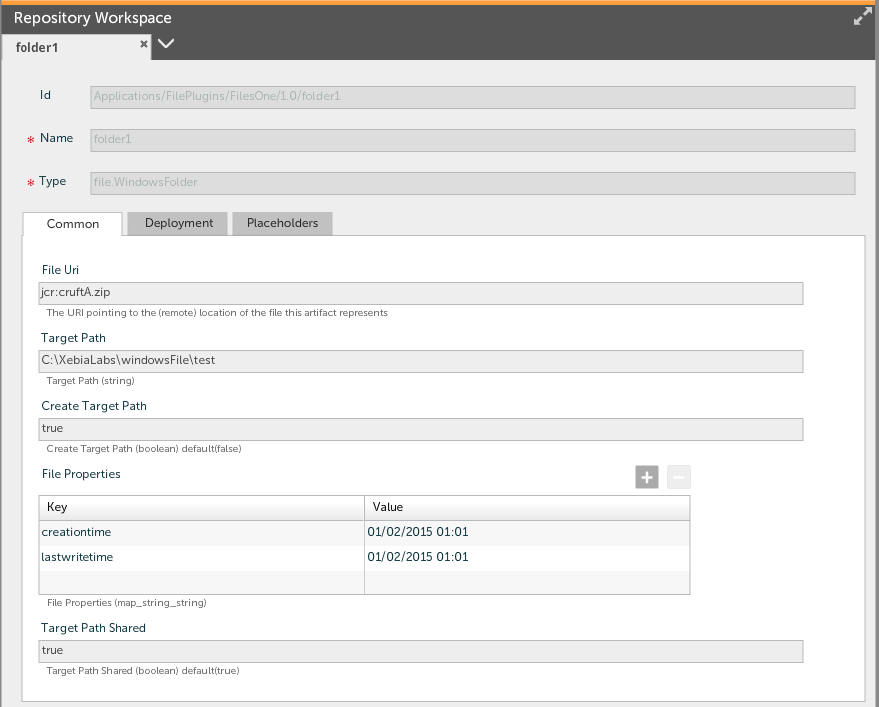
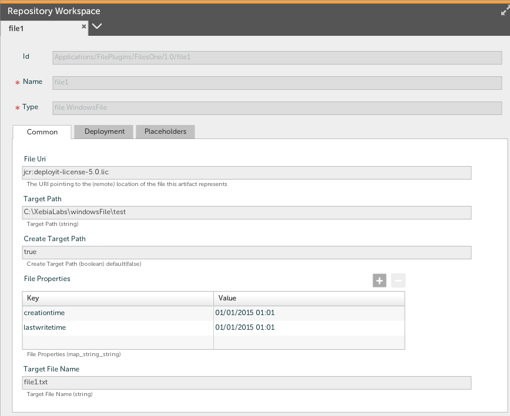

# Windows File plugin #

# Overview #

The Windows file plugin allows you to manage files and folders copied on Windows systems

# Requirements #

* **Deployit requirements**
	* **Deployit**: version 4.7

# Installation #

Place the plugin JAR file into your `SERVER_HOME/plugins` directory. 

# Features #

The Windows file plugin provides most of the same features as the Unix File plugin for Windows.  Some of the useful features are as follows:

* Shared sub-folders (i.e. sub folders are not deleted if they still contain objects)
* Conditional updates of files based on check sums
* Ability to set addributes on files

# Examples #

There are two basic types that this plugin supports as follows:
* File.WindowsFolder
* File.WindowsFile

When copying new artifacts to the target it is possible to set properties (attributes) of the file by defining the attribute names and values in the **File Properties** box.  This is the same as executing the powershell command as follows:

`$(Get-Item <filename> ).<property key>=<property value>`

## File.WindowsFolder Example ##

## File.WindowsFile Example ##

